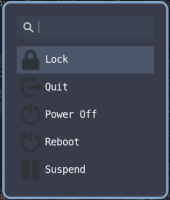

# wofi-hyprland-power-menu
Power menu for Hyprland using Wofi.

This project is based on [power-menu.sh](https://github.com/acarl005/dotfiles/tree/master/waybar/scripts).

## Preview

## Remarks
- For screen lock it requires hyprlock.
   
- To toggle the script by e.g. mainMod + Q, include in your Hyprland config:
 
  `
  bind = $mainMod, Q, exec, pkill wofi || wofi-power-menu.sh #Power menu
  `

  (The script should be made executable by `chmod +x` and placed in a directory included in your `$PATH`.)
